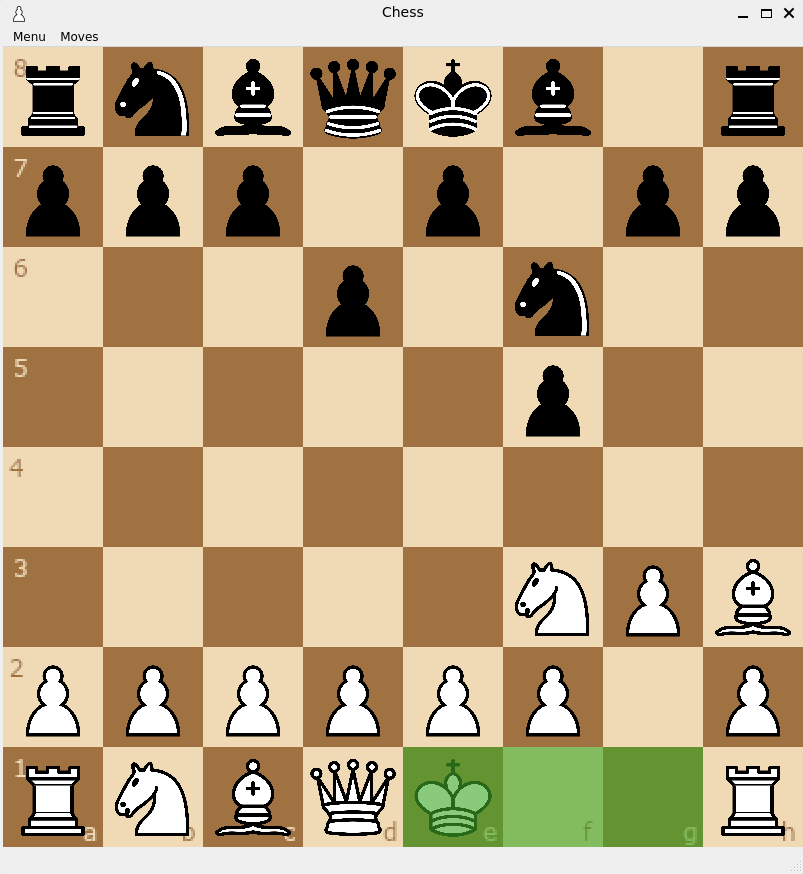

# Chess
Projekt semestralny z [Programowania Obiektowego](https://usosweb.usos.pw.edu.pl/kontroler.php?_action=katalog2/przedmioty/pokazPrzedmiot&prz_kod=103B-INxxx-ISP-PROI) (2023, semestr letni)


## Autorzy
* Maksym Bieńkowski
* Mikołaj Garbowski
* Michał Łuszczek


## Funkcjonalności
Projekt umożliwia grę w szachy z drugą osobą lub z botem za pośrednictwem interfejsu graficznego lub tekstowego, wspiera import i eksport stanu gry w formacie [FEN](https://en.wikipedia.org/wiki/Forsyth%E2%80%93Edwards_Notation).

### Projekt wykorzystuje 
* bibliotekę Qt do interfejsu graficznego i zarządzania komunikacją międzyprocesową
* framework GoogleTest do testów jednostkowych
* silnik szachowy Stockfish jako backend dla jednej z implementacji bota szachowego

Projekt jest podzielony na 4 moduły oraz moduł z testami jednostkowymi.

### Biblioteka `chess`
Zawiera podstawową logikę gry w szachy, linkowana jako zależność do różnych implementacji interfejsu użytkownika.

Główna funkcjonalność (wykonywanie ruchu, cofanie ruchu, sprawdzanie stanu zakończenia gry) jest dostępna z poziomu obiektu klasy `Game` reprezentującego partię szachów, najważniejsze metody do wykorzystania przez interfejs użytkownika to:

(plik `Game.h`)
```cpp
class Game {
    ...
public:
    GameOver isOver() const;
    void makeMove(const Move& move, bool updateHistory = true);
    void undoMove();
    void redoMove();
};
```

Do importowania i eksportowania stanu gry w notacji FEN służy klasa `FENParser`
```cpp
class FENParser {
    ...
public:
    static Game parseGame(const std::string &fen);

    static std::string gameToString(const Game &game);
};
```

Wyliczenie `GameOver` informuje o powodzie zakończenia gry
```cpp
enum class GameOver {
    NOT_OVER,
    MATE,
    STALEMATE,
    INSUFFICIENT_MATERIAL,
    FIFTY_MOVE_RULE,
    THREEFOLD_REPETITION,
};
```

### Biblioteka `bot`
Zawiera interfejs `ChessBot` do bota szachowego, wyliczającego najlepszy ruch w danym momencie gry.

Implementacja `StockfishBot` wykorzystuje silnik szachowy stockfish

```cpp
class ChessBot {
    ...
public:
    virtual Move getBestNextMove() const = 0;
    
    ...
};
```

### Aplikacja `cli`
Tekstowy interfejs użytkownika umożliwiający grę w 2 osoby lub grę z botem. Zależy od bibliotek `chess` i `bot`.

Jako opcjonalny pierwszy argument pozycyjny przyjmuje początkowy stan gry zapisany w notacji FEN (wspierany przez popularne serwisy jak https://chess.com)

```
8  ♜  ♞  ♝  ♛  ♚  ♝  ♞  ♜  
7  ♟  ♟  ♟  ♟  ♟  ♟  ♟  ♟ 
6                       
5
4              
3
2  ♙  ♙  ♙  ♙  ♙  ♙  ♙  ♙
1  ♖  ♘  ♗  ♕  ♔  ♗  ♘  ♖
   A  B  C  D  E  F  G  H
   
White move >
```
### Aplikacja `gui`
Graficzny interfejs użytkownika umożliwiający grę w 2 osoby lub grę z botem. Zależy od bibliotek `chess` i `bot` oraz Qt.

Wspiera import i eksport stanu gry do notacji FEN, a także cofanie i odcofywanie ruchów klawiszami strzałek lub z poziomu paska menu.



### Testy jednostkowe `all-unit-tests`
Testy wykorzystują framework [GoogleTest](https://google.github.io/googletest/)

Wszystkie testy można uruchomić jako aplikację `all-unit-tests` dostępna jako cel kompilacji dla CMake

## Zalety i potencjał na dalszy rozwój
* Poprawne działanie logiki jest zapewniane przez pokrycie testami
* Zastosowanie inwersji zależności umożliwia rozbudowanie projektu o więcej implementajci bota szachowego lub dodanie wsparcia dla większej liczby standardowych formatów
* Modularna budowa projektu pozwala na reużywania logiki gry przez różne implementacje interfejsu użytkownika
* Zastosowanie dynamicznego polimorfizmu i wzorców projektowych eliminuje duplikację kodu

## Diagram klas
Narzędzie do edycji - [Visual Paradigm](https://online.visual-paradigm.com/drive)

Plik do zaimportowania w aplikacji `./docs/class-diagram.vpd`

## Instrukcja uruchamiania (Linux)
### Zależności
* [Qt w wersji 6.5](https://doc.qt.io/qt-6/get-and-install-qt.html)
* [Stockfish](https://stockfishchess.org/) (wymagany w przypadku gry z botem) zainstalowany lokalnie i dostępny w PATH jako `stockfish`

### Instalacja stockfish
Pobierz plik binarny właściwy dla danej platformy ze [strony](https://stockfishchess.org/download/) lub skompiluj ze [źródeł](https://github.com/official-stockfish/Stockfish)

Dodaj lokalną instalację do PATH, (zmodyfikuj zmienną środowiskową `PATH` lub dodaj symlink do pliku wykonywalnego w katalogu znajdującym się w PATH)

```bash
sudo ln -s  <ścieżka do pliku wykonywalnego> /usr/local/bin/stockfish
```

### Kompilacja pliku wykonywalnego z użyciem CMake
Utwórz katalog docelowy
```bash
mkdir chess-build
cd chess-build
```

Załaduj konfigurację CMake, wymaga podania ściezki do lokalnej instalacji biblioteki 

```bash
cmake <główny katalog projektu> -DQt6_DIR:PATH=<ścieżka do instalacji Qt>
```

Na przykład:
```bash
cmake /home/mgarbowski/proi/chess -DQt6_DIR:PATH=~/Qt/6.5.0/gcc_64/lib/cmake/Qt6
```

Aby skompilować projekt należy wskazać target, dostępne to
* `gui` dla interfejsu graficznego
* `cli` dla interfejsu tekstowego
* `all-unit-tests` - dla testów jendostkowych

```bash
cmake --build . --target gui
```

Uruchomienie pliku wykonywalnego
```bash
./src/gui/gui
```